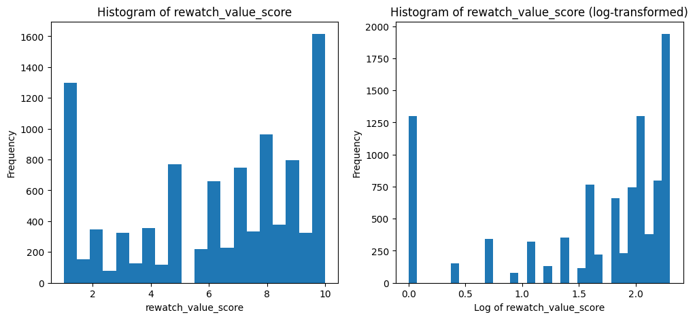
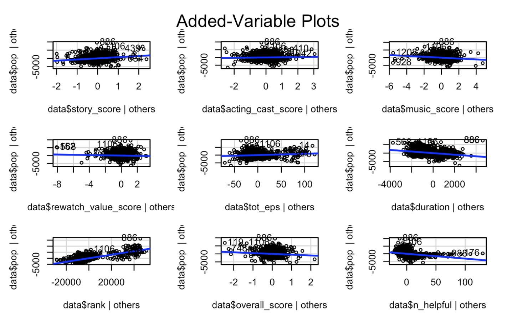

# **STAT W5243: Applied Data Science - Project 1: Korean Drama Analysis**
**Group 12:** Mengyan Li (ml4779), Zishun Shen (zs2695), Zhisheng Yang (zy2675), Shayan Chowdhury (sc4040)
**Spring 2025 - February 19, 2025**

##### Link to Github: <https://github.com/My990813/Applied-Data-Science-Project-One>

# Introduction and Data

The global popularity of Korean dramas (K-dramas) has grown significantly in recent years, presenting an opportunity to analyze the factors contributing to their success and audience reception. Our study examines a comprehensive dataset of K-dramas from 2015 to 2023, integrating information from multiple sources to understand the relationships between production characteristics, viewer ratings, and commercial success. The project began with team members proposing different datasets, with the Korean Drama dataset (proposed by Mengyan Li) ultimately being selected due to its complexity, data quality challenges, and interpretability potential. We began with the [Korean Drama from 2015-2023 with Actors & Reviews by Chanon Charuchinda - Kaggle](https://www.kaggle.com/datasets/chanoncharuchinda/korean-drama-2015-23-actor-and-reviewmydramalist) dataset, originally compiled by data expert Chanon Charuchinda through web scraping from [MyDramaList.com](https://mydramalist.com).

With that dataset as our starting point, we worked with five distinct but related datasets: 

1. **Korean Dramas from 2015-2023** (1,752 records, 17 columns): 
- Source: [Chanon Charuchinda on Kaggle](https://www.kaggle.com/datasets/chanoncharuchinda/korean-drama-2015-23-actor-and-reviewmydramalist)
- Contains comprehensive drama information including: 
    - Basic metadata (ID, name, release year)
    - Production details (director, screenwriter)
    - Broadcast information (episodes, duration, air dates, network)
    - Content details (rating, synopsis)
    - Performance metrics (website ranking, popularity ranking)
- Raw data location: [korean_drama.csv](data/raw/korean_drama.csv)

2. **Top Korean Drama List (~1500)** 
- Source: [Top Korean Drama List (~1500) by Noor Rizki - Kaggle](https://www.kaggle.com/datasets/noorrizki/top-korean-drama-list-1500)
- Similar to Dataset 1 but has a larger number of dramas (1500)
- Raw data location: [kdrama_list.csv](data/raw/kdrama_list.csv)

3. **Top 100 Korean Dramas (2023)** 
- Source: [🏯 Top 100 KDrama 2023 by Gianina-Maria Petrascu - Kaggle](https://www.kaggle.com/datasets/gianinamariapetrascu/top-100-k-drama-2023)
- Similar to Dataset 1 but has more detailed information on the best dramas in 2023 only
- Raw data location: [top_100_kdrama.csv](data/raw/top_100_kdrama.csv)

We merged datasets 1-3 to get a dataset with... [finish this]

4. **Movie Industry Sales Revenue in South Korea (2014-2023)** 
- Source: [Movie Industry Sales Revenue in South Korea 2014-2023 by ID831717 - Statista](https://www.statista.com/statistics/831717/south-korea-film-industry-sales-revenue/)
- Contains revenue data for the Korean film industry from 2014 to 2023, which we used to 
- Raw data location: [statistic_id831717_movie-industry-sales-revenue-in-south-korea-2014-2023.xlsx](data/raw/statistic_id831717_movie-industry-sales-revenue-in-south-korea-2014-2023.xlsx)

5. **Reviews for Korean Dramas from 2015-2023 (Dataset 1)** 
- Source: [Korean Drama from 2015-2023 with Actors & Reviews by Chanon Charuchinda - Kaggle](https://www.kaggle.com/datasets/chanoncharuchinda/korean-drama-2015-23-actor-and-reviewmydramalist)
- Same as Dataset 1 but with review data
- Raw data location: [reviews.csv](data/raw/reviews.csv)

In our project, we looked at Korean Drama information data and review data for Korean Drama from 2015 to 2023. In the beginning of the project, each of us brought the data we are interested in to the meeting and voted for the best data. Mengyan Li brought this Korean Drama Data because of her interest in Korean drama. In the end of the meeting, Korean Drama Data got the highest vote because of its complexity and interpretability. The data is from Kaggle. <https://www.kaggle.com/datasets/chanoncharuchinda/korean-drama-2015-23-actor-and-reviewmydramalist?select=reviews.csv> It was made by Chanon Charuchinda, a data expert, for educational purpose.

As explained by Chanon Charuchinda, the data was taken from <https://mydramalist.com/shows/top_korean_dramas?page=1> through web scraping. Chanon Charuchinda shared four csv data in Kaggle. After discussion, we chose two csv data—korean_drama.csv which included 1752 Korean drama's information and review.csv which included 10625 reviews given to the drama from users on the website. We chose these two because the other two csv did not contain any numerical data.

There are 10 columns in review.csv including user ID, drama name, Score for Story, Score for acting, Score for music, Score for rewatch value, Overall Score, Review, Number of episode that the reviewer watched, and Number of people on the website that find this comment helpful.

## Research Objectives
Our analysis focused on three key relationships: 
1. the connection between popularity, ranking and viewer ratings
1. the relationship between popularity and textual review sentiment (using NLP methods)
1. the correlation between drama popularity and industry revenue

# Methodology

## Initial Data Collection

Because of interest in Korean drama, we searched Korean drama on Kaggle and found the files. The data was taken from <https://mydramalist.com/shows/top_korean_dramas?page=1> through web scraping by Chanon Charuchinda–a data expert on Kaggle. The data is structured data with data quality problem such as date format, missing value, and outliers. The date contains mismatched date. Some are month-date-year but some are date-month-year. There are many missing values and outliers. For example, in the `pop` column in korean_drama.csv, there are many 99999 which are different from other Popularity Ranking values and are obviously outliers. And for missing values: there are many missing values in the categorical variable for example director name. And we cannot use KNN or other imputation methods for it.

Our study focus is popularity of Korean dramas. Many variables may contribute to the popularity such as the length of drama, music, and acting. Thus we focus on what score the users give to the dramas in many different sectors–music, story, acting, etc. And we also look at the correlation between different variables such as rank and popularity. We used multiple statistical methods such as t-test, linear regression to approach this problem and found meaningful results.

## Data Cleaning

{fig-align="left" width="400"}

{fig-align="left"}

The above are the two tables we started for the data cleaning process. The following are our approaches:

In the first step, we focused on **removing outliers**, particularly in the popularity ('pop') and overall score columns, as these would serve as dependent variables in our linear regression analyses. Using boxplot visualization with interquartile range calculations, we identified and removed data points that fell outside the upper and lower limits. This process resulted in the removal of 609 outlier entries, significantly improving the data's statistical validity.

The second step **addressed inconsistencies in date formatting** across the dataset. We encountered various date formats, with some entries following a month-date-year format while others used date-month-year. Using Python's `datetime` library, we standardized all dates to a consistent year-month-day format. During this process, we made the decision to exclude entries that contained only month and year information, as these incomplete date entries could potentially skew our temporal analysis. 

The third step involved **handling missing values** in the dataset. Our analysis revealed that the majority of missing data occurred in three main categories: director names, screenwriter names, and network information. While our initial plan was to complete these missing entries through web scraping from various drama databases, time constraints of our two-week project deadline made this approach impractical. We did end up writing a script for web scraping using Selenium and BeautifulSoup (can be found under [scripts/scrape_mydramalist.py](./scripts/scrape_mydramalist.py)), but due to rate limiting, we were unable to scrape all the necessary data in time. Theoretically with more time, we could have scraped all the missing data and filled in the missing values. Instead, we opted to replace missing categorical values with "Others" as a placeholder and removed entries with missing numerical values to maintain data integrity for our quantitative analyses.

## Data Merging
### Merging the Korean Drama Datasets (Datasets 1-3)
To combine the three Korean drama datasets spanning 2015-2023, since we noticed that all the datasets have the drama names (with different column names), we decided to merge the datasets using that column. 

First, datasets 1 (1,752 dramas) and 2 (1,647 dramas) were merged using an outer join on the title column, resulting in 2,302 unique entries. Missing values in overlapping columns were filled using corresponding values from the other dataset, with special handling for episode counts that required string parsing.

Second, we incorporated dataset 3 (100 top dramas from 2023) using another outer join on common columns plus the title field, expanding the final dataset to 2,402 entries. Duplicate entries were removed by keeping only the first occurrence when grouping by title and year. The merged dataset preserved the most complete information from 
each dataset while standardizing formats and handling overlapping data fields systematically. 

The following is the final merged and cleaned Korean Dramas dataset, spanning 3 other datasets: 

{fig-align="left"}

### Merging the (Merged) Korean Drama Dataset with Review Data (Datasets 5)
For merging the merged Korean Drama Dataset with the Review dataset (Dataset 5), we similarly merged the two tables on their respective drama title columns, and then dropped any rows where numerical values were missing. This resulted in a final dataset of 11,776 rows with 32 columns.

### Merging the (Merged) Korean Drama Dataset with Yearly Revenue Data (Datasets 4)
Since this merging process is a little bit different from the previous two merges, we will explain it in detail. 

Just to demonstrate, the revenue data is yearly:  
{fig-align="left"}

Note that this revenue variable is for the entire South Korean film industry, not just dramas. However, Korean dramas do indeed contribute a significant portion of South Korea's economic output, including revenue from exports and employment. This analysis is still useful to see how the drama industry is doing relative to the rest of the film industry.

Furthermore, we merge the revenue data with the drama data by year. To do so, we grouped the drama data by year and then merged the revenue data with the drama data by year. With our resulting dataset, we can compare the trends of revenue by year alongside the other numerical variables: 
{fig-align="left"}

We also generated a correlation heatmap of the revenue data with the other numerical variables:
{fig-align="left"}

Here are some notable findings from the line plots and correlation matrix above:
- Pre-Pandemic Trends (2015-2019)
    - `revenue` of the South Korean Film Industry showed steady growth from 2015 to 2019, while scores gradually improved
    - `tot_eps` (total episodes) was decreasing steadily, suggesting a trend toward shorter series formats while maintaining higher revenue
    - `pop` (popularity) and `rank` maintained relatively stable patterns, indicating consistent audience engagement
- Pandemic Impact (2020)
    - `revenue` dropped sharply in 2020, falling to about 0.5 trillion won from 1.9 trillion won in 2019
    - Surprisingly, `score` remained stable during this period, suggesting that while the industry's financial performance suffered, content quality was maintained. Or that during the pandemic, shows that were filmed prior were being released. Or that the audience was more forgiving during the pandemic.
    - `tot_eps` continued its downward trend, possibly accelerated by production challenges during the pandemic
- Post-Pandemic Recovery (2021-2023)
    - `revenue` shows a gradual recovery pattern but hasn't returned to pre-pandemic levels
    - `score` reached its highest point (8.6) in 2023, showing significant improvement
    - `pop` and `rank` show volatile patterns during the recovery period

**Other Notable Findings:**
- The strong negative correlation between `year` and `tot_eps` (total number of episodes) (-0.95) suggests a clear industry shift toward shorter formats—whether due to the pandemic or other factors
- The positive correlation between `tot_eps` and `revenue` (0.68) implies that longer series historically generated more revenue, though this trend might be changing
- The relatively weak correlation between `revenue` and `popularity/rank` (-0.062/-0.00023) suggests that commercial success isn't necessarily tied to traditional popularity metrics

## Exploratory Data Analysis

Below is the summary statistics of variables: We can see the mean for `music_score`, `story_score`, `acting_cast_score`, `rewatch_value_score`, and `overall_score` are very close to the median compared to other variables. Although they are close, the data itself is still skewed. The standard deviation of the popularity ranking is the highest, meaning there is a lot of variation in the data.

|       |       year |   tot_eps |   duration |     rank |      pop |   story_score |   acting_cast_score |   music_score |   rewatch_value_score |   overall_score |   n_helpful |
|:------|-----------:|----------:|-----------:|---------:|---------:|--------------:|--------------------:|--------------:|----------------------:|----------------:|------------:|
| count | 9823       | 9823      |    9823    |  9823    |  9823    |    9823       |          9823       |    9823       |            9823       |      9823       |   9823      |
| mean  | 2019.11    |   18.7209 |    3020.11 |  3196.22 |  1401.66 |       7.56179 |             8.50097 |       7.67276 |               6.24    |         7.70294 |     16.2043 |
| std   |    2.29225 |   17.0432 |    1333.96 |  2816.44 |  1547.09 |       2.18148 |             1.6858  |       2.12697 |               3.06633 |         2.05787 |     32.6251 |
| min   | 2015       |    1      |      52    |     8    |     1    |       1       |             1       |       1       |               1       |         1       |      0      |
| 25%   | 2017       |   12      |    1980    |   985    |   331    |       6.5     |             8       |       6.5     |               4       |         6.5     |      2      |
| 50%   | 2019       |   16      |    3600    |  2506    |   875    |       8       |             9       |       8       |               7       |         8       |      6      |
| 75%   | 2021       |   16      |    4200    |  5090    |  1893.5  |       9       |            10       |       9.5     |               9       |         9.5     |     16      |
| max   | 2023       |  150      |    6000    | 56186    | 14507    |      10       |            10       |      10       |              10       |        10       |    551      |

Definition of each variable (column header): 
- `year`: Year of the drama (2015-2023)
- `tot_eps`: Total number of episodes
- `duration`: Duration of each episode
- `rank`: Ranking of the drama (lower is more popular)
- `pop`: Popularity ranking of the drama (lower is more popular)
- `story_score`: User-submitted score for story (from reviews)
- `acting_cast_score`: User-submitted score for acting cast (from reviews)
- `music_score`: User-submitted score for music (from reviews)
- `rewatch_value_score`: User-submitted score for rewatch value (from reviews)
- `overall_score`: User-submitted overall score (from reviews)
- `n_helpful`: Number of people that found review helpful (from reviews)

### Distribution of Numerical Variables (and Log Transformed)

To study the distribution of numerical variables, we first plotted the histograms of all numeric variables, along with log transformations of those distributions as done in class. Below are the histograms of greatest interest, but all the distributions can be found in our [final_report.ipynb](./final_report.ipynb) Jupyter notebook.

- `pop` (popularity ranking) remains heavily right-skewed, with most dramas having low popularity scores (<2000) and a few outliers reaching 12000+. As we saw in class, a log transformation makes the distribution more normal, suggesting a multiplicative effect in popularity growth

- `n_helpful` shows an extreme right skew, with most reviews getting few helpful votes and a rapid drop-off

- `tot_eps` shows distinct clustering around certain episode counts (16, 32, or 50 episode dramas across multiple seasons), reflecting common show format lengths 

`duration` also exhibits multiple distinct peaks, likely corresponding to standard episode lengths for different drama formats

- Most score related columns: `story_score`, `acting_cast_score`, `music_score`, `overall_score` are left-skewed, meaning that most viewers gave high scores to most dramas, while a few have very low score (e.g. 1-2). As we saw in class, a log transformation of left-skewed data does not make the distribution more normal but in fact skews it more to the left. 
- Only `overall_score` is shown above for brevity, but once again, all the distributions can be found in [final_report.ipynb](./final_report.ipynb)

- The only potential exception is `rewatch_value_score`, which is bi-modal with a slight left skew, suggesting that most dramas fall into two categories: those that are highly rewatchable (9-10) and likely one-time watches (1-2)

{fig-align="left" width="300"}
- `rank` and `pop` (popularity ranking) are also right skewed. Since higher number in ranking means lower popularity, most drama ranked high in the ranking and only a few have low popularity.

{fig-align="left" width="300"}
- `overall_score` is left skewed, meaning most audience gave high scores to the drama overall. The data for the `n_helpful` (number of people that found review helpful) is right skewed, meaning the review are very personalized so that not so many people hold same opinion.

### Correlation Heatmap and Plots of Numerical Variables

Below is the correlation heatmap of all numerical values and some notable findings:

- `overall_score` has very strong **positive correlations** with `story_score` (0.9), `rewatch_value_score` (0.83), `acting_cast_score` (0.79), and `music_score` (0.7)—which is to be expected, people who enjoy the story, acting, and music are more likely to enjoy the drama overall
- `pop` has a **moderate positive correlation** with `rank` (0.5), suggesting that more popular dramas might not always have the best rankings  
- `duration` has **negative correlations** with `rank` (-0.40) and `pop` (-0.38)
- `year` exhibits very weak correlations with most variables, suggesting quality and sentiment metrics aren't strongly tied to when the drama was released

Digging deeper into individual variable correlations, we can see that `pop` (popularity) and `rank` are highly correlated. And `music_score`, `story_score`, `acting_cast_score`, `rewatch_value_score`, and `overall_score` are highly correlated:

{fig-align="left"}

### Linear Regression Analysis

Same thing happened when we look at the linear regression plot. We can see that there is a positive relationship between `pop` (popularity rank) and `rank`. We also found that there is a negative relationship between `duration` and `pop`, meaning longer drama has higher popularity. Interesting thing to see is that there is a negative relationship between `n_helpful` (number of people found the review helpful) and `pop`, meaning when there is more people sharing same opinion, the drama is more popular.

By looking at the drama information and the review separately, we did the following EDA and analysis:

This is the linear regression analysis between the `overall_score` and `story_score`, `acting_cast_score`, `music_score`, and `rewatch_value_score`. We can see that these are all positive relationship, meaning the `story_score`, `acting_cast_score`, `music_score`, and `rewatch_value_score` all have a positive impact on the `overall_score`.

By looking at the drama information without the impact of review, we found the following thing:

{fig-align="left"}

This is a simple linear regression without standardization and normalization.

Comparison: Without standardization and normalization and with standardization and normalization:

| Feature                  | Coefficient |
|--------------------------|-------------|
| `year`                     | -16         |
| `tot_eps` | 7           |
| `duration` | -0.6        |
| `rank`                     | 0.2         |

| Feature                  | Coefficient |
|--------------------------|-------------|
| `year`                     | -38         |
| `tot_eps` | 195         |
| `duration` | -929        |
| `rank`                     | 3146        |

This is with standardization and normalization.

`rank` was already strongly correlated with `pop`, but because it had a larger scale originally, it may have had a smaller coefficient in the unstandardized model. After standardization, its impact is clearer, leading to a larger coefficient, indicating that it has the strongest influence in predicting popularity.

{fig-align="left"}

From the bar chart, `rank` has the strongest positive impact, suggesting that higher-ranked dramas are significantly more popular. `duration`, on the other hand, has a substantial negative effect, indicating that dramas aired for a longer period tend to be less popular, possibly due to audiences losing interest over time. `tot_eps` has a smaller but still positive influence, implying that dramas with more episodes may attract greater engagement. Finally, the `year` of release has the least impact, showing that a drama’s release year is not a major factor in determining its popularity.

{fig-align="left"}

The actual vs. predicted popularity of K-dramas can tell us some insights about the model fit.

The blue line represents the actual popularity values, sorted in increasing order. The red crosses represent the predicted popularity values from the linear regression model.

The predicted values roughly follow the increasing trend of actual popularity, indicating that the model is capturing some underlying patterns.

There is significant scatter in the predicted values, especially in the higher popularity range. This suggests that the model struggles to accurately predict very popular dramas. The linear regression model seems to perform better for less popular dramas (left side of the graph), where the red points are closer to the blue line. The variance increases significantly as popularity rises.

|                          | T statistics | p value |
|--------------------------|--------------|---------|
| Year                     | -0.03        | 0.98    |
| Total number of episodes | 0.30         | 0.76    |
| Duration of each episode | 2.65         | 0.01    |
| rank                     | -0.79        | 0.43    |

### T-test on Standardized Variables

In this T-test on standardized variables, the null hypothesis (H₀) states that there is no significant difference in the mean values of each feature between the training and test sets. The results indicate that most features, including `year`, `tot_eps` (total number of episodes), and `rank`, are well-balanced between the training and test sets, as their high p-values suggest no significant difference in their distributions. However, `duration` stands out with a statistically significant p-value (0.008), implying a potential distribution shift between the two sets. This suggests that the model might face inconsistencies when predicting dramas with extreme duration values, possibly affecting overall performance.

Besides, we also did analysis on the directors and screenwriters of Korean drama:

{fig-align="left" width="433"}

{fig-align="left" width="413"}

{fig-align="left" width="413"}

{fig-align="left" width="404"}

The top 10 and bottom 10 directors/screenwriters with respect to Korean Drama ranking and popularity are shown in the above charts. Besides, we also did some analysis based on time difference:

{fig-align="left"}

From the boxplots, we can see Korean Drama ranking increased from 2015 to 2018, and there was a slightly decreasing trend after 2019, which is also supported by the trend of mean ranking each year. There was an apparent increase in the overall popularity of Korean Drama (since lower number indicates higher popularity).

{fig-align="left"}

From the missing value heatmap, we can see most missing values are the name of directors and screenwriters, and Network that it aired on.

## Feature Engineering

### Variance and Box-Cox Transformation

Below are the feature engineering we did:

{fig-align="left"}

First, we checked the variance of all numerical features and we set a threshold of 0.01. After calculation, no features has zero or near zero variance, thus our features are all good.  

Next, we performed feature transformation. First, it is unnecessary to normalize the 5 score attributes since they are already with the range [0, 10]. It is sufficient to divide them by 10. Then, we performed box-cox transformation to the rest 5 numerical attributes to reduce their skewness. These 5 numerical attributes require rescaling, since their ranges are diverse. The Number of people-finding-this-comment-helpful (n_helpful) is applied normalization instead of standardization because it is skewed to 0. Since Rank and Popularity are both ranking-variables, they are applied the reversive function f(x)=1-x after normalization. Total number of episodes (tot_eps) and Duration of single episode in second (duration) are applied normalization instead of standardization due to their limited value sets.
Not all categorical variables are encoded. For example, year is not encoded since it is useful as the index for time series analysis; attributes like directors and screenwriters are impractical to encode directly, as this will produce hundreds of new variables. The only variables we applied one-hot encoding to are Content Rating (content_rt) and Aired-on Date (aired_on) because their types are limited. Content Rating was simply one-hot encoded. For Aired-on Date, since a show can be aired on several days of week, we created 7 new variables for each day of week, so each entry can have multiple True values among the 7.
The following is the refined version of feature engineering:

Below is the final cleaned data after feature engineering:

{fig-align="left"}

### ML-based Sentiment Analysis
Since we have access to the full text of the reviews, we decided to analyze the emotional valence of user reviews. To do so, we implemented machine learning-based sentiment analysis using a pre-trained DistilBERT model (we chose the [lxyuan/distilbert-base-multilingual-cased-sentiments-student](https://huggingface.co/lxyuan/distilbert-base-multilingual-cased-sentiments-student) variant due to its performance on benchmark datasets). The model was deployed using the Hugging Face [`transformers`](https://huggingface.co/docs/transformers/en/index) library and configured to run on the optimal available hardware (MPS for Apple Silicon, CUDA for NVIDIA GPUs, or CPU as fallback). Reviews were processed in batches of 100 to optimize computational efficiency while managing memory usage.

The analysis revealed a relatively balanced distribution between positive (4,891) and negative (4,871) reviews, with only 61 classified as neutral. This sentiment data was merged with our existing features to provide additional context for understanding viewer reception patterns and their relationship with drama characteristics like episode length, acting scores, and overall popularity.

Below is the correlation matrix of the sentiment analysis with notable findings:
{fig-align="left"}
- Strong negative correlation (-0.99) between `sentiment_negative` and `sentiment_positive`, which is expected as they are opposing measures
- Positive sentiment shows moderate positive correlations with `story_score` (0.4), `rewatch_value_score` (0.41), and `overall_score` (0.41)—suggesting that better-rated dramas tend to generate more positive sentiment in reviews. This also demonstrates that the sentiment analysis is working as intended; the text of the reviews is being analyzed correctly.
- `sentiment_neutral` shows very weak correlations across the board, suggesting neutral reviews don't strongly relate to any other metrics

# Key Findings

Our comprehensive analysis of **Korean drama data from 2015-2023** revealed several significant patterns across multiple dimensions of the industry. Through statistical analysis of features and audience reception, we identified clear trends in viewing preferences and content evolution.

**Statistical Validity**: The statistical analysis demonstrated **meaningful variance** across all examined features, validating their inclusion in our study. Numerical variables consistently showed asymmetrical distributions, necessitating careful statistical analysis through **Box-Cox transformations and standardization**. 

**Audience Reception Analysis**: Our sentiment analysis pipeline, using the **DistilBERT model**, revealed fascinating insights into viewer behavior and preferences. Review scores demonstrated a pronounced left-skewed distribution, with the majority of dramas receiving **ratings between 8-10**. The analysis uncovered an almost perfect split between **positive (4,891)** and **negative (4,871)** reviews, with remarkably few neutral sentiments (61 reviews). This polarization suggests that K-dramas tend to elicit **strong emotional responses** from viewers, with **robust correlations between positive sentiment and high scores** across story quality (0.4), rewatch value (0.41), and overall rating (0.41).

**Audience Reception Analysis (Reviews)**: Content format preferences emerged as a crucial factor in drama success. Our analysis revealed that dramas with **fewer than 20 episodes** consistently achieved higher popularity rankings, indicating a clear audience preference for more concise storytelling formats. This finding was reinforced by the **negative correlation (-0.38)** between episode duration and popularity ranking. The **bi-modal distribution of rewatch value scores** further suggested that dramas tend to fall into two distinct categories: highly rewatchable content (scoring 9-10) or single-viewing experiences (scoring 1-2). Similarly, since there is a negative relationship between overall score/rewatch value score/music score and popularity ranking and there is a positive relationship between story score/acting cast score and popularity ranking, it's likely that most of the audience enjoys a Korean drama because of its story and acting cast, but higher level of music or rewatch value means less popularity. In other words, most audience may not like a Korean drama due to its music or rewatch value.

# Challenges and Future Recommendations

Our research encountered several significant challenges that inform our recommendations for future studies. **Data quality** presented persistent challenges, particularly regarding missing information for directors and screenwriters, inconsistent date formatting across sources, and varying levels of completeness in our multiple data sources. These issues required substantial preprocessing and standardization efforts.

**Technical limitations** also impacted our research scope. Web scraping restrictions from [MyDramaList](https://mydramalist.com)'s anti-bot protections constrained our ability to gather additional historical data. Resource constraints affected our processing of large-scale sentiment analysis, and memory management became crucial when handling high-dimensional feature spaces after categorical encoding.

Looking forward, we recommend several key areas for future research enhancement. First, implementing **advanced web scraping** techniques using rotating proxies and user agents would enable more comprehensive data collection. We also suggest developing automated data validation and standardization pipelines to improve data quality consistency. Establishing direct partnerships with data providers for **API access** would significantly enhance data reliability and completeness.

Additionally, incorporating production **budget data**, international **viewing statistics**, and **marketing spend** information would provide a more complete picture of drama success factors. These enhancements, combined with robust cross-validation methods and ensemble prediction approaches, would significantly advance our understanding of the Korean drama industry's evolution and success factors. Going even further, given the abundance of text data in our dataset, implementation of **topic modeling** on review text and synopses could uncover deeper thematic trends.

# Contribution:
- **Mengyan Li (ml4779)**: Finding the data, Data Cleaning(fixing date format, remove outliers, merge datasets, drop/change to others for missing values), EDA(summary statistics, linear regression for the merged data and review.csv,correlation heatmap, missing value heatmap, histrogram for numerical variables), feature engineering(filter out zero/near-zero variance features, Box-Cox transformation, standardization/normalization, one-hot encoding), Report drafting

- **Zishun Shen (zs2695)**: EDA(tentatively approach to visualize the dataset, top and bottom ranking of the directors and screenwriters through popularity rank and rank, ranking through year boxplot), feature engineering (one-hot encoding)

- **Zhisheng Yang (zy2675)**: Data Cleaning(tentatively approach to drop missing values), EDA and feature engneering(linear regression visualization and standardize/normalize data, t test, feature importance bar chart, The actual vs. predicted popularity of K-dramas)

- **Shayan Chowdhury (sc4040)**: report drafting and editing, web scraping script, combining popularity/ranking and revenue over the year, ML-based sentiment analysis of reviews using HuggingFace transformers and DistilBERT (feature engineering), merging of multiple kdramas datasets, merging of kdramas + revenue dataset